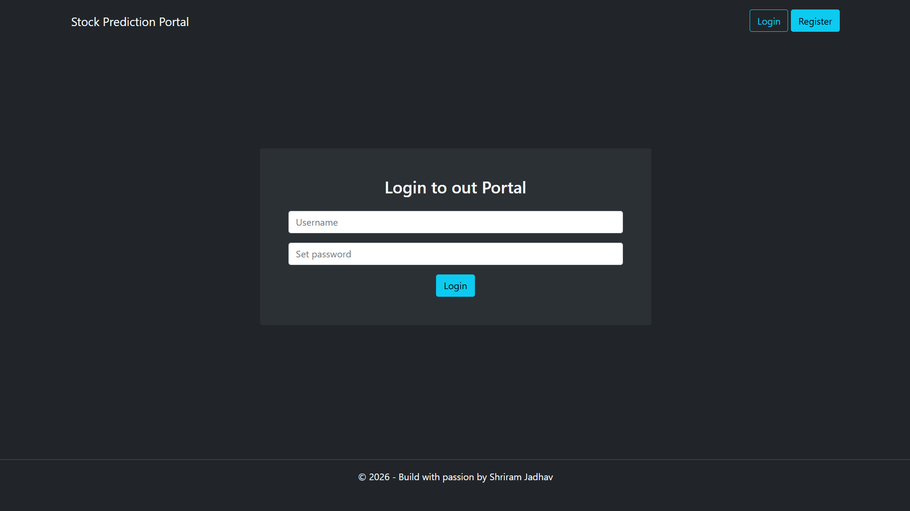
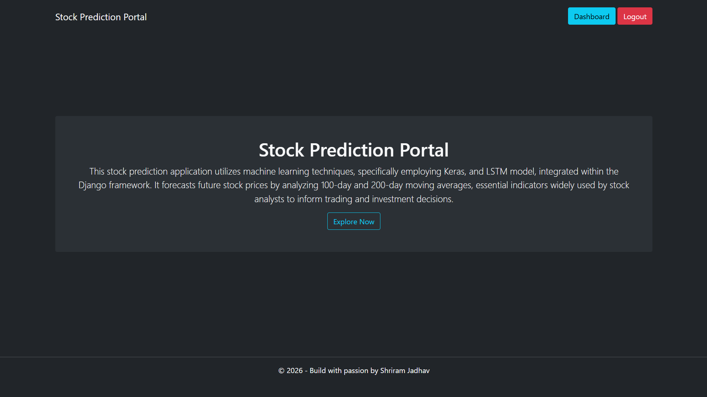
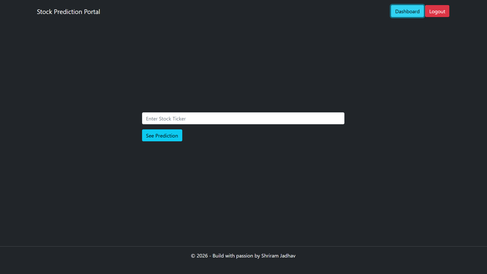
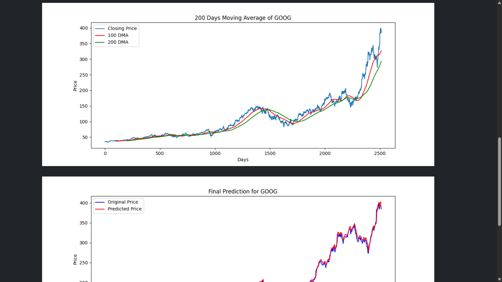
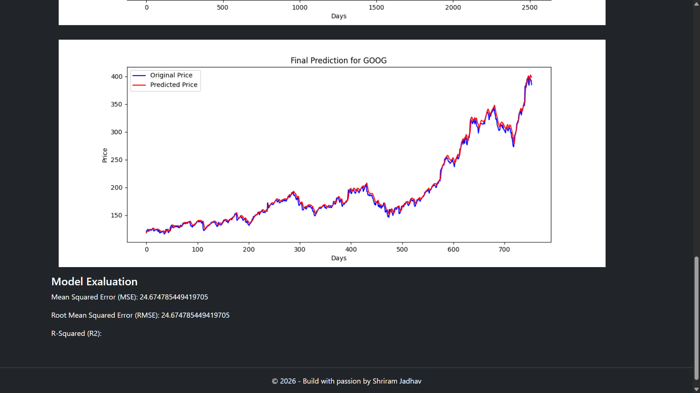

# Stock Prediction Portal using Django, React & LSTM

A Full Stack Machine Learning project built using Django REST Framework, React.js, and LSTM Neural Networks for stock price prediction.

---

# Project Overview

This project is a Stock Prediction Portal that allows users to:

- Enter a stock ticker symbol
- Fetch real-time stock market data using Yahoo Finance
- Visualize stock trends
- Generate moving averages
- Predict stock prices using an LSTM Deep Learning model

The project combines:

- Backend API development with Django REST Framework
- Frontend UI development with React.js
- Deep Learning using TensorFlow/Keras
- Data Visualization using Matplotlib
- Data Analysis using Pandas & NumPy

---

# Features

- JWT Authentication System
- REST API Integration
- React Frontend with Django Backend
- Real-time Stock Data using yFinance
- LSTM-based Stock Prediction
- 100 Days Moving Average Visualization
- 200 Days Moving Average Visualization
- Final Prediction Graph
- Machine Learning Model Integration with Web Application

---

# Tech Stack

## Frontend

- React.js
- Vite
- Axios
- Bootstrap

## Backend

- Django
- Django REST Framework
- Simple JWT Authentication

## Machine Learning

- TensorFlow
- Keras
- LSTM Neural Network
- Scikit-learn

## Data Analysis & Visualization

- Pandas
- NumPy
- Matplotlib
- yFinance

---

# Project Structure

```bash
stock-prediction-portal/
│
├── backend-drf/
├── frontend-react/
├── Resources/
├── screenshots/
└── README.md
```

---

# Screenshots

## Authentication Page



---

## Stock Prediction Homepage



---

## Stock Prediction Dashboard



---

## Moving Average Visualization



---

## Final Prediction Graph



---

# How to Run the Project

## Clone Repository

```bash
git clone https://github.com/shriram-jadhav/stock-prediction-portal.git
```

---

# Backend Setup

```bash
cd backend-drf
```

Create virtual environment:

```bash
python -m venv env
```

Activate virtual environment:

## Windows

```bash
env\Scripts\activate
```

Install dependencies:

```bash
pip install -r requirements.txt
```

Run backend server:

```bash
python manage.py runserver
```

Backend runs on:

```txt
http://127.0.0.1:8000
```

---

# Frontend Setup

```bash
cd frontend-react
```

Install dependencies:

```bash
npm install
```

Run frontend:

```bash
npm run dev
```

Frontend runs on:

```txt
http://localhost:5173
```

---

# Machine Learning Model

The stock prediction model was built using:

- LSTM Neural Network
- TensorFlow/Keras
- Historical stock market data

The model predicts stock prices based on previous market trends.

---

# Important Disclaimer

This project is developed strictly for educational purposes.

The prediction model SHOULD NOT be used for real-world stock trading or financial investments.

Stock markets are highly unpredictable and using this model in real trading environments may lead to financial losses.

---

# Learning Outcomes

This project helped in understanding:

- REST API Development
- Django REST Framework
- React Frontend Development
- JWT Authentication
- Machine Learning Workflow
- Deep Learning with LSTM
- Data Analysis & Visualization
- Integration of ML Models with Web Applications

---

# Author

Shriram Jadhav

GitHub:
https://github.com/shriram-jadhav
